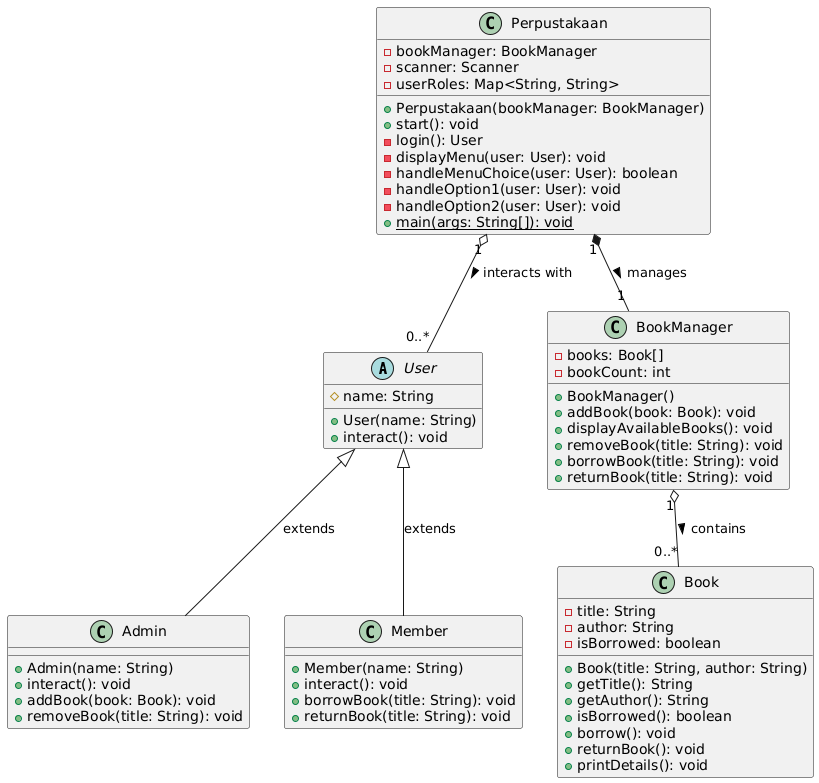

# Sistem Perpustakaan - Team Assignment 1 (Group 2)

## Deskripsi
Ini merupakan aplikasi Perpustakaan yang simpel berbasis konsol menggunakan Java untuk mengelola operasi dasar perpustakaan. Aplikasi ini memiliki dua jenis pengguna: Admin dan Member, dengan fungsionalitas yang berbeda untuk masing-masing peran.

## Fitur Utama
### Admin
- ✅ Menambah buku baru ke perpustakaan
- ✅ Menghapus buku dari perpustakaan
- ✅ Melihat daftar semua buku yang tersedia

### Member
- ✅ Meminjam buku dari perpustakaan
- ✅ Mengembalikan buku yang dipinjam
- ✅ Melihat daftar semua buku yang tersedia

## Class Diagram


### Deskripsi Kelas
- **User**: Kelas abstrak yang menjadi parent untuk Admin dan Member
- **Admin**: Kelas yang mewarisi User, dapat mengelola buku (tambah/hapus)
- **Member**: Kelas yang mewarisi User, dapat meminjam/mengembalikan buku
- **Book**: Kelas yang merepresentasikan entitas buku dengan properti title, author, dan status peminjaman
- **BookManager**: Kelas yang mengelola operasi CRUD untuk buku
- **Perpustakaan**: Kelas utama yang mengatur alur aplikasi dan user interface

## Instalasi dan Penggunaan

### Prasyarat
- Java Development Kit (JDK) 8 atau lebih tinggi
- Make (opsional, untuk menggunakan Makefile)

### Cara Menjalankan

#### Menggunakan Makefile (Direkomendasikan)
```bash
# Compi;e program
make compile

# Menjalankan program
make run

# Atau compile dan jalankan secara langsung
make start

# Membersihkan file build
make clean
```

#### Menggunakan Command Line Java
```bash
# Compile semua file Java
javac -d build src/*.java

# Menjalankan program
java -cp build Perpustakaan
```

## Pengembang
Group 2
